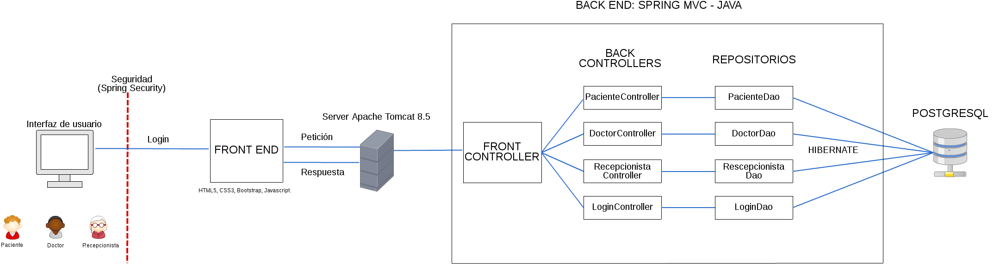
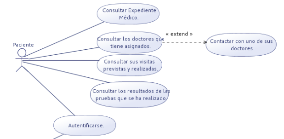
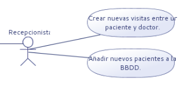
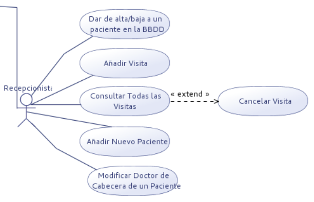

%Intranet Clínica Médica
%Kevin Ramos López<br>David Pareja Rodríguez
%DAW-Curs 2 2016/2017

# Introducción

## Descripción

Todos somos conscientes del duro trabajo que realizan los doctores y demás empleados en las clínicas.<br>
Pero pocos pensamos en la gran cantidad de información con la que tienen que trabajar.<br>
**¿Por que no facilitarles ese trabajo?**

## ¿Cómo?

Con una aplicación web que permita almacenar información de manera segura y acceder a ella de manera cómoda y rápida.

# Información

## Servicios utilizados

> - JAVA Spring MVC
> - Framework: Hibernate
> - HTML5/CSS3 + Bootstrap
> - Jquery/JavaScript
> - PostgreSQL

## Diagrama de Arquitectura



## Diagrama de BBDD

[Ver](../Documentacion/DiagramaBBDD.png)

## Casos de Uso

Vamos a ver una breve comparación entre los casos de uso planeados inicialmente y el resultado final.

## Usuario


## Director


## Director


## Paciente



## Paciente


## Empleado


## Empleado


## Doctor


##Doctor


## Recepcionista



## Recepcionista



## Diagrama de Clases

[Ver](../Documentacion/DiagramaClasesClinica.png)

## Manual de Usuario

[Manual PDF](../Documentacion/Manual_de_Usuario.pdf)

# Código

## Introducción

Explicación y ejemplos sobre la arquitectura y plugins utilizados.

## Arquitectura Back End

> - Repositories
> - Controllers
> - Entities
> - Beans
> - AccessCheck
> - Validation Class

## Repositories

```
package org.escoladeltreball.proyectowiaw2.repositories;

import java.util.List;

@Service
@Repository
@Transactional
public class DoctorDAO {

	
	@PersistenceContext
	protected EntityManager manager;
	
	//Obtiene un doctor a partir de un dni
	public Doctor getDoctor(String dni) {
		
		Query query = manager.createNamedQuery("findDoctorByDni").setParameter("dni", dni);
		Doctor doctor = (Doctor)query.getSingleResult();
		
		return doctor;
	}
	
	//Obtiene una lista con todas las pruebas
	public List<Prueba> getAllPruebas() {
		
		Query query = manager.createNamedQuery("findAllPruebas");
		List<Prueba> pruebas = query.getResultList();
		
		return pruebas;
	}
	
	//Obtiene una lista con las pruebas de un paciente
	public List<Prueba> getAllPruebasOfPacient(Paciente paciente) {
		
		Query query = manager.createNamedQuery("findPruebaByPaciente").setParameter("paciente", paciente);
		List<Prueba> pruebas = query.getResultList();
		
		return pruebas;
	}
	
	//Obtiene una lista con las pruebas de un tipo de prueba
	public List<Prueba> getAllPruebasOfTipoPrueba(TipoPrueba tipo) {
		
		Query query = manager.createNamedQuery("findPruebaByTipo").setParameter("tipo", tipo);
		List<Prueba> pruebas = query.getResultList();
		
		return pruebas;
	}
	
	//Obtiene una prueba por Id
	public Resultado getResultadoById(long id) {
		
		Query query = manager.createNamedQuery("findResultadoById").setParameter("id", id);
		Resultado resultado = (Resultado)query.getSingleResult();
		
		return resultado;
	}
	
	//Obtiene un resultado por Id
	public Prueba getPruebaById(long id) {
		
		Query query = manager.createNamedQuery("findPruebaById").setParameter("id", id);
		Prueba prueba = (Prueba)query.getSingleResult();
		
		return prueba;
	}
	
	//Obtiene un Tipo de prueba por id
	public TipoPrueba getTipoPruebaById(long id) {
		
		Query query = manager.createNamedQuery("findTipoPruebaById").setParameter("id", id);
		TipoPrueba tipoPrueba = (TipoPrueba)query.getSingleResult();
		
		return tipoPrueba;
	}
	
	//Merge de una visita
	public void mergeVisita(Visita visita) {
		
		manager.merge(visita);
		manager.flush();
	}
	
	//Merge de una prueba
	public void mergePrueba(Prueba prueba) {
		
		manager.merge(prueba);
		manager.flush();
	}
	
	//Merge de un resultado
	public void mergeResultado(Resultado resultado) {
		
		manager.merge(resultado);
		manager.flush();
	}	
}
```
## Controllers

```
package org.escoladeltreball.proyectowiaw2.controllers;

@Controller
public class DoctorController {
	
	@Autowired
	UsuarioDAO usuarioDao;
	
	@Autowired
	RecepcionistaDAO recepcionistaDao;
	
	@Autowired
	PacienteDAO pacienteDao;
	
	@Autowired
	DoctorDAO doctorDao;
	
	@Autowired
	DirectorDAO directorDao;
	
	@Autowired
	EmpleadoDAO empleadoDao;
	
	@Autowired
	AccessCheck accessCheck;
	
	//VISITAS################################################################################################################################################
	
	//Lista las visitas de el doctor que realiza la consulta
	@RequestMapping(value="/listMyVisitas", method = RequestMethod.GET)
	public String listMyVisitas(Locale locale, Model model, Principal principal) {
		
		try {
			///////////////////////////////////////////////////
			accessCheck.metodoDoctor(principal.getName());
			///////////////////////////////////////////////////
		} catch (AccessDeniedException e) {
			List<String> mensajes = new ArrayList<String>();
			model.addAttribute("error","Acceso no Permitido.");
			mensajes.add("Esta pagina es solo para doctores.");
			mensajes.add("Solo un doctor puede consultar sus propias visitas.");
			model.addAttribute("mensajes",mensajes);
			return "mensaje";
		}
		
		Doctor doctor = doctorDao.getDoctor(principal.getName());
		
		//Pasamos las visitas que tiene programadas este doctor
		model.addAttribute("visitas",doctor.getVisitas());
		
		return "visita-list";
	}
	
	//Una vez realizada una visita permite finalizar esta e introducir las observaciones
	@RequestMapping("/finVisita/{id}")
	public String delVisita(Locale locale, Model model, Principal principal,
			@PathVariable("id") long id){
		
		try {
			///////////////////////////////////////////////////
			accessCheck.metodoDoctor(principal.getName());
			///////////////////////////////////////////////////
		} catch (AccessDeniedException e) {
			List<String> mensajes = new ArrayList<String>();
			model.addAttribute("error","Acceso no Permitido.");
			mensajes.add("Esta pagina es solo para doctores.");
			mensajes.add("Solo un doctor puede finalizar una visita.");
			model.addAttribute("mensajes",mensajes);
			return "mensaje";
		}		
		Visita visita = recepcionistaDao.findOneVisita(id);
		
		model.addAttribute("paciente", visita.getPaciente());
		model.addAttribute("doctor", visita.getDoctor());
		model.addAttribute("recepcionista", visita.getRecepcionista());
		model.addAttribute("visita", visita);
		model.addAttribute("fin", "yes");
		
		return "info-visita";
		
		//return "redirect:/listVisitas";
		
	}
	
	//Añade observaciones a una visita
	@PostMapping(value = "/addObservaciones/{id}")
	public String addContrato(Principal principal, Model model,  
			@PathVariable("id") long id,
			@RequestParam("observaciones") String observaciones){
		
		Visita visita = recepcionistaDao.findOneVisita(id);
		
		model.addAttribute("paciente", visita.getPaciente());
		model.addAttribute("doctor", visita.getDoctor());
		model.addAttribute("recepcionista", visita.getRecepcionista());
		model.addAttribute("visita", visita);
		
		
		//Solo modificamos las visitas que se encuentran pendientes y que sean propias
		if(!visita.getEstado().equals("Pendiente") || !visita.getDoctor().getDni().equals(principal.getName())){
			model.addAttribute("notPermit", "Esta acción no está permitida, solo puedes añadir observaciones en visitas pendientes y propias");
			
			model.addAttribute("fin", "no");
			
			return "info-visita";
		}
		else{
			visita.setObservaciones(observaciones);
			visita.setEstado("Finalizada");
			
			model.addAttribute("fin", "no");
			
			doctorDao.mergeVisita(visita);
			
			return "info-visita";
		}
		
	}
	
	//PRUEBAS################################################################################################################################################
	
	//Lista todas las pruebas
	@RequestMapping(value="/listPruebas", method = RequestMethod.GET)
	public String listPruebas(Locale locale, Model model, Principal principal) {
		
		try {
			///////////////////////////////////////////////////
			accessCheck.metodoMedicina(principal.getName());
			///////////////////////////////////////////////////
		} catch (AccessDeniedException e) {
			List<String> mensajes = new ArrayList<String>();
			model.addAttribute("error","Acceso no Permitido.");
			mensajes.add("Esta pagina es solo para doctores o directores.");
			mensajes.add("Solo un doctor o directivo pueden consultar todas las pruebas realizadas.");
			model.addAttribute("mensajes",mensajes);
			return "mensaje";
		}
		
		Usuario usuario = usuarioDao.usuario(principal.getName());
		
		List<Prueba> pruebas = doctorDao.getAllPruebas();
		
		model.addAttribute("pruebas", pruebas);
		
		return "pruebas-list";
	}
	
	//Lista las pruebas de un paciente
	@RequestMapping(value="/listPruebas/{dni}", method = RequestMethod.GET)
	public String listPruebasOfPacient(Locale locale, Model model, Principal principal,
			@PathVariable("dni") String dni) {
		
		///////////////////////////////////////////////////		
		accessCheck.metodoUsuario(principal.getName());
		///////////////////////////////////////////////////
		
		Usuario usuario = usuarioDao.usuario(principal.getName());
		
		Paciente paciente = pacienteDao.getPaciente(dni);
		
		List<Prueba> pruebas = doctorDao.getAllPruebasOfPacient(paciente);
		
		model.addAttribute("pruebas", pruebas);
		
		return "pruebas-list";
	}
	
	//Lista las pruebas de un tipo de prueba concreto
	@RequestMapping(value="/pruebasDe/{id}", method = RequestMethod.GET)
	public String listPruebasOfTipoPrueba(Locale locale, Model model, Principal principal,
			@PathVariable("id") long id) {
		
		try {
			///////////////////////////////////////////////////
			accessCheck.metodoMedicina(principal.getName());
			///////////////////////////////////////////////////
		} catch (AccessDeniedException e) {
			List<String> mensajes = new ArrayList<String>();
			model.addAttribute("error","Acceso no Permitido.");
			mensajes.add("Esta pagina es solo para empleados.");
			mensajes.add("Solo un empleado puede consultar las pruebas de un paciente.");
			model.addAttribute("mensajes",mensajes);
			return "mensaje";
		}
		
		Usuario usuario = usuarioDao.usuario(principal.getName());
		
		List<Prueba> pruebas = doctorDao.getAllPruebasOfTipoPrueba(doctorDao.getTipoPruebaById(id));
		
		model.addAttribute("pruebas", pruebas);
		
		return "pruebas-list";
	}
	
	
	//Muestra el formulario para añadir una nueva prueba de un paciente
	@RequestMapping(value="/addPrueba", method = RequestMethod.GET)
	public String addPrueba(Locale locale, Model model, Principal principal) {
		
		try {
			///////////////////////////////////////////////////
			accessCheck.metodoDoctor(principal.getName());
			///////////////////////////////////////////////////
		} catch (AccessDeniedException e) {
			List<String> mensajes = new ArrayList<String>();
			model.addAttribute("error","Acceso no Permitido.");
			mensajes.add("Esta pagina es solo para doctores.");
			mensajes.add("Solo un doctor puede añadir nuevas pruebas sobre un paciente.");
			model.addAttribute("mensajes",mensajes);
			return "mensaje";
		}
		
		List<Paciente> pacientes = pacienteDao.getPacientes();
		
		List<TipoPrueba> tiposPruebas = usuarioDao.listAllTipoPruebas();
		
		model.addAttribute("pacientes", pacientes);
		model.addAttribute("tiposPruebas", tiposPruebas);
		
		return "add-prueba-form";
	}
	
	//Añade una nueva prueba de un paciente en la BBDD
	@PostMapping(value = "/addPrueba")
	public String addPrueba(Principal principal, Model model,  
			@RequestParam("dniPaciente") String dni,
			@RequestParam("idTipoPrueba") long idTipoPrueba,
			@RequestParam("observaciones") String observaciones){
		
		Paciente paciente = pacienteDao.getPaciente(dni);
		TipoPrueba tipoPrueba = usuarioDao.listOneTipoPruebas(idTipoPrueba);
		
		Prueba prueba = new Prueba();
		
		prueba.setFecha(LocalDate.now());
		prueba.setPaciente(paciente);
		prueba.setObservaciones(observaciones);
		prueba.setTipo(tipoPrueba);
		
		doctorDao.mergePrueba(prueba);
		
		return "redirect:/dash";
	}
	
	//Muestra información de una prueba concreta
	@RequestMapping(value="/prueba/{id}", method = RequestMethod.GET)
	public String listOnePrueba(Locale locale, Model model, Principal principal,
			@PathVariable("id") long id) {
		
		///////////////////////////////////////////////////		
		accessCheck.metodoUsuario(principal.getName());
		///////////////////////////////////////////////////
		
		Usuario usuario = usuarioDao.usuario(principal.getName());
		
		Prueba prueba = doctorDao.getPruebaById(id);

		model.addAttribute("prueba", prueba);
		model.addAttribute("addResult", false);
		
		return "info-prueba";
	}
	
	//RESULTADOS################################################################################################################################################
	
	//Muestra el formulario para a��adir un nuevo resultado
	@RequestMapping(value="/addResultado/{id}", method = RequestMethod.GET)
	public String addResultadoForm(Principal principal, Model model,  
			@PathVariable("id") long id){
		
		try {
			///////////////////////////////////////////////////
			accessCheck.metodoDoctor(principal.getName());
			///////////////////////////////////////////////////
		} catch (AccessDeniedException e) {
			List<String> mensajes = new ArrayList<String>();
			model.addAttribute("error","Acceso no Permitido.");
			mensajes.add("Esta pagina es solo para doctores.");
			mensajes.add("Solo un doctor puede añadir nuevos resultados sobre una prueba.");
			model.addAttribute("mensajes",mensajes);
			return "mensaje";
		}
		
		Prueba prueba = doctorDao.getPruebaById(id);
		
		model.addAttribute("prueba", prueba);
		model.addAttribute("addResult", true);
		
		return "info-prueba";
	}
	
	//Muestra el formulario para modificar un resultado existente
	@RequestMapping(value="/modResultado/{id}", method = RequestMethod.GET)
	public String modResultadoForm(Principal principal, Model model,  
			@PathVariable("id") long id){
		
		try {
			///////////////////////////////////////////////////
			accessCheck.metodoDoctor(principal.getName());
			///////////////////////////////////////////////////
		} catch (AccessDeniedException e) {
			List<String> mensajes = new ArrayList<String>();
			model.addAttribute("error","Acceso no Permitido.");
			mensajes.add("Esta pagina es solo para doctores.");
			mensajes.add("Solo un doctor puede modificar resultados sobre una prueba.");
			model.addAttribute("mensajes",mensajes);
			return "mensaje";
		}
		
		Resultado resultado = doctorDao.getResultadoById(id);
		
		model.addAttribute("prueba", resultado.getPrueba());
		model.addAttribute("existResult", resultado);
		
		model.addAttribute("modResult", true);
		
		return "info-prueba";
	}
	
	//Añade una nuevo resultado de una prueba en la BBDD
	@PostMapping(value = "/addResultado/{id}")
	public String addResultado(Principal principal, Model model,  
			@RequestParam("resultado") int resultado,
			@RequestParam("comentarios") String comentarios,
			@PathVariable("id") long id){
		
		Prueba prueba = doctorDao.getPruebaById(id);
		
		Resultado newResultado = new Resultado();
				
		newResultado.setPrueba(prueba);
		newResultado.setResultado(resultado);
		newResultado.setComentarios(comentarios);
		
		doctorDao.mergeResultado(newResultado);
		
		
		return "redirect:/prueba/"+id;
	}
	
	//Modifica un resultado existente de una prueba en la BBDD
	@PostMapping(value = "/modResultado/{id}")
	public String modResultado(Principal principal, Model model,  
			@RequestParam("resultado") int resultado,
			@RequestParam("comentarios") String comentarios,
			@PathVariable("id") long id){
		
		Resultado newResultado = doctorDao.getResultadoById(id);
				
		newResultado.setResultado(resultado);
		newResultado.setComentarios(comentarios);
		
		doctorDao.mergeResultado(newResultado);
		
		return "redirect:/prueba/"+newResultado.getPrueba().getId();
	}

}

```

## Entities

```
package org.escoladeltreball.proyectowiaw2.entities;

@Entity(name = "DoctorEntity")
@Table(name = "doctor")
@PrimaryKeyJoinColumn(name = "id", referencedColumnName = "id")
@NamedQueries(value = {
	    @NamedQuery(name = "findAllDoctors", query = "SELECT d FROM DoctorEntity d"),
	    @NamedQuery(name = "findAllDoctorsActivos", query = "SELECT d FROM DoctorEntity d where d.activo = true"),
	    @NamedQuery(name = "findAllCabecera", query = "SELECT d FROM DoctorEntity d where d.especialidad = 'cabecera' and d.activo = true"),
	    @NamedQuery(name = "findAllCabeceraDni", query = "SELECT d.dni FROM DoctorEntity d where d.especialidad = 'cabecera' and d.activo = true"),
	    @NamedQuery(name = "findDoctorByDni", query = "SELECT d FROM DoctorEntity d where d.dni = :dni"),
	    @NamedQuery(name = "findDoctorById", query = "SELECT d FROM DoctorEntity d where d.id = :id"),
	})
public class Doctor extends Empleado implements Serializable {
	private static final long serialVersionUID = 1L;
	
	@Column(nullable=false)
	private String especialidad;
	
	@OneToMany(cascade={CascadeType.PERSIST, CascadeType.MERGE},orphanRemoval=true, mappedBy= "doctorCabecera", fetch = FetchType.EAGER)
	@Fetch(value = FetchMode.SUBSELECT)
	private List<Paciente> pacientes;
	
	
	@OneToMany(cascade={CascadeType.PERSIST, CascadeType.MERGE},orphanRemoval=true, mappedBy= "doctor",  fetch = FetchType.EAGER)
	@Fetch(value = FetchMode.SUBSELECT)
	private List<Visita> visitas;
	
	public Doctor(){
		super();
	}

	public Doctor(String especialidad, List<Paciente> pacientes, List<Visita> visitas) {
		this.especialidad = especialidad;
		this.pacientes = pacientes;
		this.visitas = visitas;
	}

	public String getEspecialidad() {
		return especialidad;
	}

	public void setEspecialidad(String especialidad) {
		this.especialidad = especialidad;
	}

	public List<Paciente> getPacientes() {
		return pacientes;
	}

	public void setPacientes(List<Paciente> pacientes) {
		this.pacientes = pacientes;
	}

	public List<Visita> getVisitas() {
		return visitas;
	}

	public void setVisitas(List<Visita> visitas) {
		this.visitas = visitas;
	}
	
}

```

## Bean

```
package org.escoladeltreball.proyectowiaw2.beans;

public class UsuarioBean {
	
	@ValidDni
	private String dni;
	
	private String password;
	
	private boolean activo;
	
	private String nombre;
	
	private String apellidos;
	
	private LocalDate fecha_nacimiento;
	
	private String codigoPostal;
	
	private String direccion;
	
	private long telefono;
	
	@ValidEmail
	private String email;
	
	//Inverse
	private List<Autoridad> autoridades = new ArrayList<Autoridad>();
	
	
	public UsuarioBean(){
		super();
	}


	public UsuarioBean(String dni, String password, boolean activo, String nombre, String apellidos,
			LocalDate fecha_nacimiento, String codigoPostal, String direccion, long telefono, String email,
			List<Autoridad> autoridades) {
		this.dni = dni;
		this.password = password;
		this.activo = activo;
		this.nombre = nombre;
		this.apellidos = apellidos;
		this.fecha_nacimiento = fecha_nacimiento;
		this.codigoPostal = codigoPostal;
		this.direccion = direccion;
		this.telefono = telefono;
		this.email = email;
		this.autoridades = autoridades;
	}


	public String getDni() {
		return dni;
	}


	public void setDni(String dni) {
		this.dni = dni;
	}


	public String getPassword() {
		return password;
	}


	public void setPassword(String password) {
		this.password = password;
	}


	public boolean isActivo() {
		return activo;
	}


	public void setActivo(boolean activo) {
		this.activo = activo;
	}


	public String getNombre() {
		return nombre;
	}


	public void setNombre(String nombre) {
		this.nombre = nombre;
	}


	public String getApellidos() {
		return apellidos;
	}


	public void setApellidos(String apellidos) {
		this.apellidos = apellidos;
	}


	public LocalDate getFecha_nacimiento() {
		return fecha_nacimiento;
	}


	public void setFecha_nacimiento(LocalDate fecha_nacimiento) {
		this.fecha_nacimiento = fecha_nacimiento;
	}


	public String getCodigoPostal() {
		return codigoPostal;
	}


	public void setCodigoPostal(String codigoPostal) {
		this.codigoPostal = codigoPostal;
	}


	public String getDireccion() {
		return direccion;
	}


	public void setDireccion(String direccion) {
		this.direccion = direccion;
	}


	public long getTelefono() {
		return telefono;
	}


	public void setTelefono(long telefono) {
		this.telefono = telefono;
	}


	public String getEmail() {
		return email;
	}


	public void setEmail(String email) {
		this.email = email;
	}


	public List<Autoridad> getAutoridades() {
		return autoridades;
	}


	public void setAutoridades(List<Autoridad> autoridades) {
		this.autoridades = autoridades;
	}


	@Override
	public String toString() {
		return "UsuarioBean [dni=" + dni + ", password=" + password + ", activo=" + activo + ", nombre=" + nombre
				+ ", apellidos=" + apellidos + ", fecha_nacimiento=" + fecha_nacimiento + ", codigoPostal="
				+ codigoPostal + ", direccion=" + direccion + ", telefono=" + telefono + ", email=" + email
				+ ", autoridades=" + autoridades + "]";
	}


	@Override
	public int hashCode() {
		final int prime = 31;
		int result = 1;
		result = prime * result + (activo ? 1231 : 1237);
		result = prime * result + ((apellidos == null) ? 0 : apellidos.hashCode());
		result = prime * result + ((autoridades == null) ? 0 : autoridades.hashCode());
		result = prime * result + ((codigoPostal == null) ? 0 : codigoPostal.hashCode());
		result = prime * result + ((direccion == null) ? 0 : direccion.hashCode());
		result = prime * result + ((dni == null) ? 0 : dni.hashCode());
		result = prime * result + ((email == null) ? 0 : email.hashCode());
		result = prime * result + ((fecha_nacimiento == null) ? 0 : fecha_nacimiento.hashCode());
		result = prime * result + ((nombre == null) ? 0 : nombre.hashCode());
		result = prime * result + ((password == null) ? 0 : password.hashCode());
		result = prime * result + (int) (telefono ^ (telefono >>> 32));
		return result;
	}


	@Override
	public boolean equals(Object obj) {
		if (this == obj)
			return true;
		if (obj == null)
			return false;
		if (getClass() != obj.getClass())
			return false;
		UsuarioBean other = (UsuarioBean) obj;
		if (activo != other.activo)
			return false;
		if (apellidos == null) {
			if (other.apellidos != null)
				return false;
		} else if (!apellidos.equals(other.apellidos))
			return false;
		if (autoridades == null) {
			if (other.autoridades != null)
				return false;
		} else if (!autoridades.equals(other.autoridades))
			return false;
		if (codigoPostal == null) {
			if (other.codigoPostal != null)
				return false;
		} else if (!codigoPostal.equals(other.codigoPostal))
			return false;
		if (direccion == null) {
			if (other.direccion != null)
				return false;
		} else if (!direccion.equals(other.direccion))
			return false;
		if (dni == null) {
			if (other.dni != null)
				return false;
		} else if (!dni.equals(other.dni))
			return false;
		if (email == null) {
			if (other.email != null)
				return false;
		} else if (!email.equals(other.email))
			return false;
		if (fecha_nacimiento == null) {
			if (other.fecha_nacimiento != null)
				return false;
		} else if (!fecha_nacimiento.equals(other.fecha_nacimiento))
			return false;
		if (nombre == null) {
			if (other.nombre != null)
				return false;
		} else if (!nombre.equals(other.nombre))
			return false;
		if (password == null) {
			if (other.password != null)
				return false;
		} else if (!password.equals(other.password))
			return false;
		if (telefono != other.telefono)
			return false;
		return true;
	}	
}

```

## Validation

```
package org.escoladeltreball.proyectowiaw2.validation;

public class DniValidator implements ConstraintValidator<ValidDni, String>{
	
	@PersistenceContext
	protected EntityManager manager;
	
	private Pattern pattern;
    private Matcher matcher;
    
	@Override
	public void initialize(ValidDni constraintAnnotation) {}
	
	@Override
	public boolean isValid(String dni, ConstraintValidatorContext context) {
		return (uniqueDni(dni));
	}
	
	//Controla que el DNI no este repetido
	private boolean uniqueDni(String dni) {
		Query queryDnis = manager.createNamedQuery("findAllDnis");
		
		List<String> dnis = queryDnis.getResultList();
		
		for(String oneDni: dnis){
			if(dni.equals(oneDni)){
				return false;
			}
		}
		
		manager.close();
		return true;
    }
}

```

## AccessCheck

```
package org.escoladeltreball.proyectowiaw2;

public interface AccessCheck {

	@Secured({"ROLE_PACIENTE"})
	void metodoPaciente(String dni);

	@Secured({"ROLE_RECEPCIONISTA"})
	void metodoRecepcionista(String dni);

	@Secured({"ROLE_DOCTOR"})
	void metodoDoctor(String dni);
	
	@Secured({"ROLE_DIRECTOR"})
	void metodoDirector(String dni);
	
	@Secured({"ROLE_RECEPCIONISTA","ROLE_DOCTOR","ROLE_DIRECTOR"})
	void metodoEmpleado(String dni);
	
	@Secured({"ROLE_RECEPCIONISTA","ROLE_DOCTOR","ROLE_DIRECTOR", "ROLE_PACIENTE"})
	void metodoUsuario(String dni);
	
	@Secured({"ROLE_DIRECTOR", "ROLE_RECEPCIONISTA"})
	void metodoOficina(String dni);
	
	@Secured({"ROLE_DIRECTOR","ROLE_DOCTOR"})
	void metodoMedicina(String dni);
}

```

##Plugins

> - Jquery Validate
> - Data Tables

##Jquery Validate

Permite validar los formularios en cliente de manera simple y eficaz.

##Jquery Validate

```
//Is numeric
jQuery.validator.addMethod("onlyNumbers", function(value, element, param) {
	return jQuery.isNumeric(value);
});

jQuery.validator.addMethod( "nieES", function ( value, element ) {
	 "use strict";
	 
	 value = value.toUpperCase();
	 
	 // Basic format test
	 if ( !value.match('((^[A-Z]{1}[0-9]{7}[A-Z0-9]{1}$|^[T]{1}[A-Z0-9]{8}$)|^[0-9]{8}[A-Z]{1}$)') ) {
	  return false;
	 }
	 
	 // Test NIE
	 //T
	 if ( /^[T]{1}/.test( value ) ) {
	  return ( value[ 8 ] === /^[T]{1}[A-Z0-9]{8}$/.test( value ) );
	 }
	 
	 //XYZ
	 if ( /^[XYZ]{1}/.test( value ) ) {
	  return (
	   value[ 8 ] === "TRWAGMYFPDXBNJZSQVHLCKE".charAt(
	    value.replace( 'X', '0' )
	     .replace( 'Y', '1' )
	     .replace( 'Z', '2' )
	     .substring( 0, 8 ) % 23
	   )
	  );
	 }
	 
	 return false;
	 
	}, "Please specify a valid NIE number." );
	
//Valid DNI
jQuery.validator.addMethod( "nifES", function ( value, element ) {
	 "use strict";
	 
	 value = value.toUpperCase();
	 
	 // Basic format test
	 if ( !value.match('((^[A-Z]{1}[0-9]{7}[A-Z0-9]{1}$|^[T]{1}[A-Z0-9]{8}$)|^[0-9]{8}[A-Z]{1}$)') ) {
	  return false;
	 }
	 
	 // Test NIF
	 if ( /^[0-9]{8}[A-Z]{1}$/.test( value ) ) {
	  return ( "TRWAGMYFPDXBNJZSQVHLCKE".charAt( value.substring( 8, 0 ) % 23 ) === value.charAt( 8 ) );
	 }
	 // Test specials NIF (starts with K, L or M)
	 if ( /^[KLM]{1}/.test( value ) ) {
	  return ( value[ 8 ] === String.fromCharCode( 64 ) );
	 }
	 
	 return false;

});

$.validator.addMethod("nif_or_nie", function(value, element) {
	var nifES = $.validator.methods["nifES"];
	var nieES = $.validator.methods["nieES"];

	return nifES.call(this, value, element) || nieES.call(this, value, element);
});


$(function() {

	$("form").validate({
	
		//Custom error class for parent div of element
		highlight: function(element) {
			$(element).parent().addClass("has-error");
		},
		unhighlight: function(element) {
			$(element).parent().removeClass("has-error");
		},
		// Reglas de validación
		rules: {
			//DOCTOR
			nombre: {
				minlength: 2,
				required: true,
				notNumber: true
			},
			apellidos: {
				minlength: 2,
				required: true,
				notNumber: true
			},
			dni: {
				nif_or_nie: true
			},
		},
		// Specify validation error messages
		messages: {
		  nombre: {
			required: "Por favor introduce un nombre",
			minlength: "La longitud debe ser superior a 2 caràcteres",
			notNumber: "El nombre no puede contener números"
		  },
		  apellidos: {
			required: "Por favor introduce un apellido",
			minlength: "La longitud debe ser superior a 2 caràcteres",
			notNumber: "El apellido no puede contener números"
		  },
		  dni: {
			  nif_or_nie: "El DNI/NIE introducido no es válido"
		  }
		},
		submitHandler: function(form) {
		  form.submit();
		}
	});
});
```

##Data Tables

Añade la funcionalidad de ordenar, paginar y buscar elementos en una tabla.

##Data Tables

```
$(document).ready(function() {
	$("#tableDoctores").DataTable({
		"scrollX": true,
		"scrollY": true
	});
} );
```
# Bugs/Problemas

## Explicación

En esta parte hablaremos de las funcionalidades que no hemos podido añadir, debido a complicaciones y falta de tiempo.

## Un empleado no puede ser a la vez paciente

Problema con Inheritance de Java.<br>
Solución encontrada pero sin tiempo para implementarla.

## No podemos almacenar carácteres especiales en la BBDD

Pensabamos que sería más simple, y finalmente no hemos tenido tiempo de solucionarlo.

## Alternativa a JS

Podría ser que el cliente no tenga JavaScript activado por X o Y razones.

> - Seria recomendable tener una alternativa en las secciones que utilizan bastante JS y jQuery.

## Control de errores

Es posible que se hayan escapado algunos casos en los que se muestra una pantalla de error de Tomcat.

# Demo

# Fin


